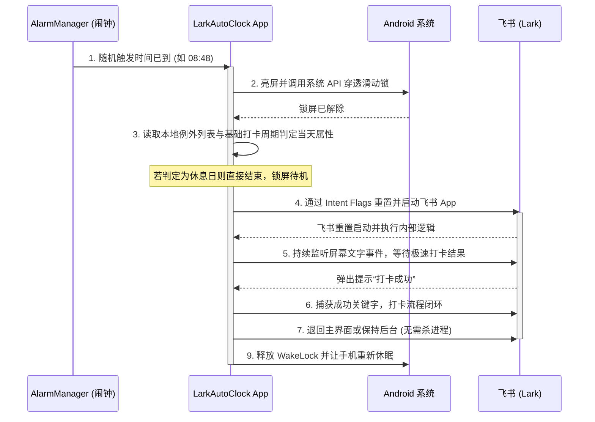

# 飞书自动打卡 Android 客户端产品需求文档 (PRD)

> [!IMPORTANT]
> **物理备用机方案说明**  
> 本产品方案基于**物理备用机方案**进行设计。即：用户准备一台闲置 Android 手机（备用机）长期放置于公司办公室内，使其连接公司真实 Wi-Fi 并持续充电。本 App 运行在备用机上，在设定时间自动执行打卡，不使用任何虚拟定位技术，确保 100% 避开飞书的定位作弊检测。

---

## 1. 项目概述

### 1.1 背景与痛点
飞书等协同办公软件对定位（GPS/Wi-Fi）有着极高精度的检测，使用常规的虚拟定位（如开发者模拟位置、Root 挂钩子）极易触发安全风控，导致打卡异常或账号封禁。
针对此痛点，最安全稳妥的自动化方案为“物理备用机打卡”——将一部闲置手机直接放置在公司，代替人工在预定时间完成物理点击。

### 1.2 项目目标
开发一款极简、高可用的 Android 应用程序（暂定名：**LarkAutoClock**），运行在公司放置的备用机上。App 将实现定时亮屏、滑动解锁、智能识别法定节假日、自动冷启动飞书并模拟人工操作打卡，最终静默退出，整个过程无需人工干预且不进行外部消息通知。

---

## 2. 技术方案设计

本方案采用轻量且安全的无侵入自动化架构，核心技术点如下：

* **自动化模拟点击**：使用 Android 系统级 **无障碍服务 (AccessibilityService)**。该服务能精准解析飞书的界面布局节点，模拟点击及手势滑动，无需 Root 权限，兼容性优异。
* **定时唤醒与解锁**：
  * 使用 Android 系统的 **硬件闹钟 (`AlarmManager.setExactAndAllowWhileIdle`)** 实现精确定时唤醒。
  * 唤醒后通过 `PowerManager.WakeLock` 强制亮屏，利用 `KeyguardManager` 识别锁屏状态，并在备用机处于“免密/仅滑动解锁”状态下模拟向上滑动动作进行解锁。
* **打卡周期与例外避让**：
  * 支持自定义基础打卡周期（如勾选周一至周五）。
  * 支持配置“例外日期”（如添加某天为强制打卡补班日，或某天为强制休息节假日）。
  * 每天调度打卡任务前，优先读取本地例外列表，再比对基础周期，决定当天是否执行打卡，全程无网络依赖。
* **进程保活与权限引导**：
  * 采用**前台服务 (Foreground Service)** 机制挂载系统常驻通知栏，降低被系统杀进程的概率。
  * App 内集成“引导设置助手”，一键协助用户关闭电池优化、允许自启动并开启无障碍服务。

---

## 3. 功能需求

### 3.1 核心功能模块

#### 3.1.1 任务配置模块
* **打卡日程表**：用户可选择基础打卡周期（支持周一至周日独立多选，默认勾选周一至周五）。
* **随机延迟触发（防风控核心）**：
  * 用户设置上下班的基准打卡时间（如：上班 09:00，下班 18:00）。
  * 支持配置“随机范围”（如：上班前 15 分钟内随机，下班后 10 分钟内随机）。
  * 每天根据随机范围重新计算当天精准的触发时间戳（如周一在 08:47 触发，周二在 08:53 触发），避免每日打卡时间完全一致。

#### 3.1.2 例外日期管理 (本地策略)
* **无网断点控制**：彻底抛弃第三方节假日 API，打卡排期判定完全转为纯本地控制，消除网络波动导致错判的风险。
* **业务逻辑判定**：
  * **优先级极高**：系统每天在准备排期打卡闹钟时，会优先比对本地的【例外日期列表】。
  * **若当前日期标记为“强制休息 (法定节假日)”**：跳过当天打卡任务。
  * **若当前日期标记为“强制打卡 (调休补班)”**：无论基础打卡周期中是否勾选此日，均正常触发打卡任务。
  * **若不在例外列表中**：按基础打卡周期（如周一至周五）的选中状态执行。

#### 3.1.3 自动化执行引擎（无障碍服务）
* **自动解锁**：硬件闹钟到点触发 -> 屏幕自动亮起 -> 通过系统底层 WindowManager 标志位与 KeyguardManager 穿透并解除无密码滑动锁。
* **飞书重置启动**：使用 `Intent.FLAG_ACTIVITY_CLEAR_TASK` 标志位拉起飞书（包名：`com.ss.android.lark`），清空所有页面栈记忆，确保每次启动后瞬间重置回飞书初始首页。
* **极速打卡与状态监听**：
  * **核心前提**：公司飞书后台必须已开启【极速打卡】功能（即用户在考勤范围内打开 App 即可自动打卡）。
  * 放弃脆弱的 UI 节点检索（不再手动点击“工作台”和“打卡”）。
  * 飞书拉起后，无障碍服务直接监听全屏文本内容，利用关键字匹配（如“打卡成功”、“极速打卡成功”）来判定本次打卡结果。
* **收尾清理**：打卡完成后，退回主界面或保持后台（不强制杀进程以保证系统稳定性），释放 WakeLock 让手机重新锁屏休眠。

#### 3.1.4 权限及保活引导助手
* 为了防止备用机在长期闲置中将 App 的后台服务杀掉，App 主页需集成快捷跳转列表：
  * **跳转无障碍服务**：引导用户一键前往系统辅助功能菜单，开启本 App 的无障碍权限。
  * **跳转电池优化**：引导用户关闭针对本 App 的省电管理，将其设为“无限制”。
  * **跳转自启动管理**：引导用户允许本 App 后台自启动和关联启动。

---

## 4. 业务流程与交互

### 4.1 静默打卡业务流程图

---

## 5. 非功能性需求

### 5.1 稳定性与保活
* **硬件级定时器**：使用 `AlarmManager.setExactAndAllowWhileIdle()` 机制，即使手机处于 Android Doze（低功耗待机）模式，也能准时唤醒。
* **无障碍系统级保活**：由于核心逻辑依附于 Android 原生的 `AccessibilityService`，系统默认会赋予极高的进程优先级（OOM_ADJ）。配合电池优化白名单与自启动权限，即可实现免后台通知的静默强力保活。

### 5.2 安全性与隐私
* **完全本地运行 (100% Offline)**：App 没有任何网络通信需求，包括不需要联网查询 API。用户的个人数据、飞书打卡记录均完全留在手机本地，不存在任何泄漏风险，彻底规避了网络嗅探或拦截问题。
* **免除 Root**：App 完全基于公开的无障碍 API 构建，不需要手机获取 Root 权限，避免触发飞书针对越狱/Root 设备的风控机制。

### 5.3 兼容性
* 适配 Android 8.0 至 Android 13 版本的原生系统及主流国产定制 ROM（MIUI/ColorOS/OriginOS/HarmonyOS 2.0+）。
* 对不同屏幕分辨率的手机，依靠 Layout Node 节点信息定位（而非死板的物理坐标），保证良好的分辨率兼容性。
