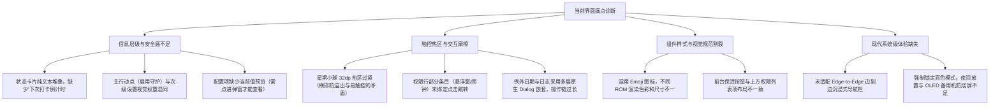

# autoDO 客户端 UI/UX 体验改进建议书

> **文档定位**：本建议书针对 autoDO（飞书自动打卡 Android 备用机工具应用）的当前界面设计与交互体验进行全面体检与审查，旨在不改动底层打卡引擎逻辑的前提下，提供一套现代化、高可用、符合 Android 规范（Material 3 / A11y）的界面设计与交互改进方案。

> **实施状态（2026-08-18 更新）**：✅ **P0 全部 3 项与 P1 全部 3 项已完成**（含 P1 中主按钮填充化、副标题预览、矢量图标）；⬜ **P2 阶段暂缓**（暗色模式实施前需先解决 `themes.xml` 中 DayNight 历史踩坑注释所述的卡片背景翻转问题，并全面梳理颜色资源）。各节内已逐项标注 ✅/⬜。

---

## 1. 当前 UI 架构体检与核心痛点

当前应用的整体架构基于单屏仪表盘（Dashboard）设计，结构紧凑直观，但在**信息层级、触控容错、细节一致性以及现代 Android 系统级适配**上存在以下主要改进空间：



---

## 2. 详细改进建议与设计方案

### 2.1 主界面（MainActivity）信息架构与层级重构

#### (1) 状态主看板（Status Card）仪表盘化
* **痛点**：当前状态看板在生效时展示为大段换行文本（`\n☀️ 上午打卡在 08:00 ~ 08:10 之间...`），视觉重心分散。作为自动化工具，用户打开 App 最关心的第一要素是**“下一次打卡会在什么时候发生”**。
* **改进方案**：
  * ⬜ **主视觉**：突出显示 **“下次执行倒计时 / 预估时刻”**（如 `⏱ 预计今天 08:06 触发打卡` 或 `下次打卡：1 小时 25 分钟后`）。（需将 `scheduleTodayClockActions` 随机生成的时刻持久化后才能展示，涉及调度器改造，暂缓）
  * ✅ **时段胶囊**：将上/下午时间段拆解为两个结构化的小卡片/胶囊（Chips）：
    * ☀️ `上午打卡窗口：07:30 ~ 08:20`
    * 🌙 `下午打卡窗口：18:00 ~ 18:10`
    （实现：`layout_status_chips` + `chip_morning` / `chip_afternoon`，工作日生效时展示，休息/未运行时隐藏；顺带修正了看板默认时段与弹窗不一致的问题）
  * ⬜ **一键修复 CTA**：当无障碍断连或权限未就绪（红底异常态）时，看板内直接提供醒目的 **「立即一键修复」** 按钮，免去用户向下翻找。

#### (2) 核心控制区（Core Actions）主次分级
* **痛点**：核心卡片内的 4 个按钮均为平铺的 `TextButton`，最核心的动作“立即启用今日自动打卡”与次要的“查看日志”权重完全相同，且缺少列表项导航箭头。
* **改进方案**：
  * ✅ **主按钮（Primary CTA）**：将「立即启用今日自动打卡」升级为独立的填充型大按钮（Filled MaterialButton），使用品牌主色或状态绿色，带有微阴影与执行状态指示。（实现：状态绿色填充 + `ic_play_arrow` 图标）
  * ✅ **设置项增加当前值副标题（Subtitle Preview）**：
    * `📅 配置打卡周期与时间` ➔ 副标题显示：`周一至周五 · 07:30~08:20 / 18:00~18:10`
    * `⛱️ 管理例外日期` ➔ 副标题显示：`已配置 2 个特殊日期`
    * 用户无需反复打开弹窗即可快速确认当前生效的规则。
    （实现：`updateConfigPreviews()` + `weekSummary()`，onResume 及弹窗保存/增删后实时刷新）
  * ✅ **补充右侧导航箭头（`chevron_right`）**：强化点击前往配置的视觉心理预期。（实现：`ic_chevron_right`）

#### (3) 权限与守护配置区（Permissions Card）规范化
* **痛点**：
  1. 当前各行使用原生 Emoji（`🛡️`、`🔄`、`🔋`）作为前缀，在不同 Android 品牌（MIUI/ColorOS/EMUI）上渲染风格、大小和基线不统一。
  2. “悬浮窗”和“精确闹钟”在代码中未绑定单独的 `OnClickListener`，状态异常时用户点击无反应。
  3. “前台保活通知”作为独立的按钮塞在卡片最底部，与上方带描述副标题的行布局割裂。
* **改进方案**：
  * ✅ **矢量图标容器（Vector Icon Badge）**：统一使用 Material Vector 图标（`ic_accessibility`, `ic_power`, `ic_schedule`, `ic_layers` 等），外层包裹 40dp 浅色圆形/圆角矩形背景框，提升整体专业感。（实现：9 个 Material symbols rounded 矢量图标 + `bg_icon_badge` 40dp 浅蓝圆形徽章）
  * ✅ **保活项重构为 Switch 列表项**：改用标准 `SwitchMaterial` 组件，与上方各行保持相同的标题+描述高度，保证卡片内视觉律动统一。（实现：`btn_keepalive` 行 + `switch_keepalive`，整行可点，已删除 `updateKeepAliveButtonUI` 与旧橙色配色）
  * ✅ **全行可点与按压水波纹**：补全所有权限行的点击事件，点击任意一行直接调用对应的系统授权 Intent。（实现：悬浮窗 → `ACTION_MANAGE_OVERLAY_PERMISSION`；精确闹钟 → `ACTION_REQUEST_SCHEDULE_EXACT_ALARM`，Android 12 以下 Toast 提示、ROM 拦截时回退应用详情页）
  * ⬜ **状态胶囊化**：将文字 `已授权 🟢` 升级为圆角微胶囊徽章（Status Chip/Badge），绿色（`#E6F4EA` 底 + `#137333` 字）与红色（`#FCE8E6` 底 + `#B3261E` 字）。（当前仍为彩色文字 + Emoji，属 P1 可选优化未纳入本次范围）

#### (4) 调试与测试工具区（Test Tools）降噪
* **痛点**：红色的警告文案与两个测试按钮长期占据主屏底部 1/3 的空间，日常使用造成视觉负担。
* **改进方案**（⬜ 未实施，属 P2 范围）：
  * 将测试区设计为 **折叠面板（Collapsible Card）** 或收纳至右上角菜单，默认折叠收起，仅在初次配置或排查故障时展开。
  * 模拟测试打卡时，提供进度弹窗/底部步骤条，直观展示测试进展（`唤醒屏幕 ➔ 拉起飞书 ➔ 识别状态`）。

---

### 2.2 弹窗与核心配置交互体验改进

#### (1) 打卡周期与时间弹窗（`dialog_time_config.xml`）
* **核心矛盾分析**：在 Dialog 有限宽度内水平排列 7 个星期选项时，放大尺寸容易导致在小屏（320~360dp）设备上折行或截断，而缩小为 32dp 导致手指点按热区较小，容易误触。
* **解决方案组合**：
  1. ✅ **视触分离（Visual & Touch Decoupling —— 最推荐）**：
     * **视觉上**：小球直径仍保持精致紧凑的 **32dp**，完全不增加水平占用宽度，7 个小球在一行内绝对安全显示。
     * **触控上**：将 7 个 `CheckBox` 的宽度设置为 `layout_width="0dp"` + `layout_weight="1"`，高度设置为 **48dp**（符合 Android 无障碍标准）。利用背景 `InsetDrawable` 或内嵌居中绘制让小圆圈居中。
     * **效果**：每个选项均拥有整列的垂直触控热区，手指只要点击对应星期的纵向区域即可 100% 精准触发，消除误触。
     （实现：新增 `bg_week_button_touch.xml` layer-list 居中固定 32dp 小球，CheckBox 本身 weight=1 + 48dp）
  2. ⬜ **增加一键预设快捷标签（一键配置，减负交互）**：
     * 星期上方增加一行小型 FilterChip 预设：`[ 🏢 工作日 (周一至周五) ]`、`[ 🔁 每天 ]`、`[ 🧹 清空 ]`。
     * 用户 90% 的场景只需轻点一下“工作日”即可完成配置，大幅降低逐个点选小球的操作频次。
  3. ⬜ **时间窗口卡片与时长直观计算**：
     * 将当前简单的灰底时间框升级为带时钟图标的卡片，并在起止时间中间动态显示计算出的 **随机窗口总时长**（例如：`07:30 ~ 08:20 ➔ ↕ 随机窗口 50 分钟`）。
     * 时间非法校验（如结束时间早于开始时间）在选择器中进行实时高亮报错，而非点击保存后才弹 Toast。

#### (2) 例外日期管理（Exceptions Dialog）⬜ 未实施（P2）
* **痛点**：目前依赖多层原生 `AlertDialog` 嵌套（点击条目弹删除确认，点击添加弹 DatePicker -> 选类型 Dialog -> 重新调用刷新整体重开），体验较为生硬。
* **改进方案**：
  * 改造为 **BottomSheetDialogFragment（底部抽屉）**。
  * 列表项支持右侧快速删除图标或滑动删除；
  * 提供优雅的**空状态（Empty State）**：当没有配置调休时，展示日历插画与占位文案 `当前无特殊调休，完全按照基础周期执行`。

#### (3) 历史打卡日志（Logs Dialog）⬜ 未实施（P2，现有实现已支持长按复制与颜色区分，单人备用机场景收益有限）
* **痛点**：当前通过单个大 `TextView` 拼接 HTML 渲染上百行日志，类似黑屏终端打印，长文本下滚动卡顿且难以筛选关键错误。
* **改进方案**：
  * 升级为 **时间轴卡片列表（Timeline RecyclerView）**。
  * 每条日志卡片化展示：时间戳、打卡类型（上班/下班/保活）、状态徽章（`打卡成功` / `无障碍断连` / `等待重试`）。
  * 顶部增加快捷过滤器标签：`[ 全部 ]`、`[ 仅看异常 ⚠️ ]`、`[ 仅看成功 ✅ ]`，并支持一键将日志导出/复制到剪贴板。

---

### 2.3 设计系统、动效与系统级体验

| 维度 | 现状 | 建议改进方案 | 预期收益 | 实施状态 |
| :--- | :--- | :--- | :--- | :--- |
| **设计系统 (Design System)** | 边距与圆角混用（4/10/12/16/20/24dp） | 统一收敛至 **8dp 网格系统**（间距: 8/16/24/32dp；圆角: 8/12/16dp） | 视觉节奏规整，消除不对齐与凌乱感 | ⬜ 未实施 |
| **系统栏适配 (Edge-to-Edge)** | 固定 ScrollView 内边距，状态栏硬编码纯白 | 引入 Android 13/14 `WindowInsetsCompat` 沉浸式边到边布局 | 完美适配打孔屏、刘海屏及手势导航栏 | ⬜ 未实施 |
| **暗色模式 (Dark Theme)** | `themes.xml` 中锁定为仅亮色 | 升级为 Material 3 DayNight 动态配色 | 适合夜间弱光环境放置备用机，降低 OLED 屏耗电与烧屏几率 | ⬜ 未实施（注意：`themes.xml` 注释记录了 DayNight 导致卡片背景翻转/浅色文字不可读的历史踩坑，实施前需全面梳理颜色资源） |
| **触感反馈 (Haptics)** | 点击切换、保存时无反馈 | 在切换星期、保存配置、点击测试时增加轻量触觉反馈（`HapticFeedbackConstants`） | 提供明确的操作确认感与盲操反馈 | ⬜ 未实施 |

---

## 3. 改进效果原型示意（ASCII 布局）

### 主界面重构示意图

```text
┌─────────────────────────────────────────────────────────┐
│  autoDO                     [ 💡 运行就绪 ]   [ ⚙️ 菜单 ] │
│  打卡智能调度中心                                        │
├─────────────────────────────────────────────────────────┤
│ ┌─ 状态看板 (Status Dashboard) ───────────────────────┐ │
│ │  🟢 今日打卡已安排生效中                            │ │
│ │  ⏱ 下次预计执行：今天 08:06（约 1 小时 25 分钟后） │ │
│ │ ┌──────────────────────┐ ┌──────────────────────┐ │ │
│ │ │ ☀️ 上班窗口          │ │ 🌙 下班窗口          │ │ │
│ │ │ 07:30 - 08:20        │ │ 18:00 - 18:10        │ │ │
│ │ └──────────────────────┘ └──────────────────────┘ │ │
│ └─────────────────────────────────────────────────────┘ │
│                                                         │
│ ┌─ 核心调度 ──────────────────────────────────────────┐ │
│ │ [ 🚀  立即下发今日打卡调度 (Filled Primary CTA)   ] │ │
│ │ ─────────────────────────────────────────────────── │ │
│ │ 📅 打卡周期与时间段                               › │ │
│ │    周一至周五 · 上午 07:30~08:20 / 下午 18:00~18:10 │ │
│ │ ─────────────────────────────────────────────────── │ │
│ │ ⛱️ 例外日期管理 (调休与节假日)                    › │ │
│ │    已设置 2 个特殊规则                              │ │
│ │ ─────────────────────────────────────────────────── │ │
│ │ 📝 查看历史打卡日志                               › │ │
│ │    最近打卡：今天 08:04 · 成功 ✅                   │ │
│ └─────────────────────────────────────────────────────┘ │
│                                                         │
│ ┌─ 权限与系统守护 ────────────────────────────────────┐ │
│ │ [🛡️] 无障碍服务                  [ 已授权 🟢 ]    › │ │
│ │ [🔋] 关闭电池优化限制            [ 已配置 🟢 ]    › │ │
│ │ [💬] 锁屏悬浮窗唤醒              [ 已授权 🟢 ]    › │ │
│ │ [⏰] 精确闹钟触发                [ 已就绪 🟢 ]    › │ │
│ │ [🔄] 开机自启动                  [ 去配置 ⚙️ ]    › │ │
│ │ ─────────────────────────────────────────────────── │ │
│ │ [🔔] 前台保活通知常驻守护           [ (○═) Switch ] │ │
│ └─────────────────────────────────────────────────────┘ │
│                                                         │
│ ▷ 开发者与测试工具 (点击展开 ▾)                          │
└─────────────────────────────────────────────────────────┘
```

---

## 4. 推荐改造路线图与优先级

* **P0 阶段（核心体验与易用性修复）** ✅ 已全部完成（2026-08-18）：
  1. ✅ 星期选择器采用“视触分离”（`layout_weight="1"` + 48dp 触控热区），彻底兼顾“窄屏防溢出”与“大热区防误触”。
  2. ✅ 权限卡片中为“悬浮窗”与“精确闹钟”补全点击跳转逻辑。
  3. ✅ 将“前台保活”重构为标准 Switch 列表条目。

* **P1 阶段（视觉层级与信息清晰度升级）** ✅ 已全部完成（2026-08-18，倒计时子项因涉及调度器改造暂缓）：
  1. ✅ 状态主看板升级为仪表盘卡片（结构化时段胶囊；⬜ “下次打卡倒计时”需持久化随机时刻，暂缓）。
  2. ✅ 核心设置项补充当前规则副标题预览（含主行动点填充式按钮与右侧导航箭头）。
  3. ✅ 用 Material 矢量图标替换 Emoji 图标（9 个 Material symbols rounded 图标 + 40dp 徽章；⬜ 权限状态文字的胶囊化未纳入本次范围）。

* **P2 阶段（高级交互与系统级润色）** ⬜ 未实施：
  1. ⬜ 历史日志弹窗升级为时间轴列表与状态过滤器。
  2. ⬜ 例外日期管理升级为 BottomSheet 底部抽屉与空状态。
  3. ⬜ 引入 Material 3 设计系统、暗色模式与 Edge-to-Edge 边到边沉浸式支持。（暗色模式实施前需先解决 `themes.xml` 中 DayNight 历史踩坑）
  4. ⬜（附加建议）测试工具区折叠化、权限状态胶囊化、下次打卡倒计时、一键预设星期标签、触感反馈。
